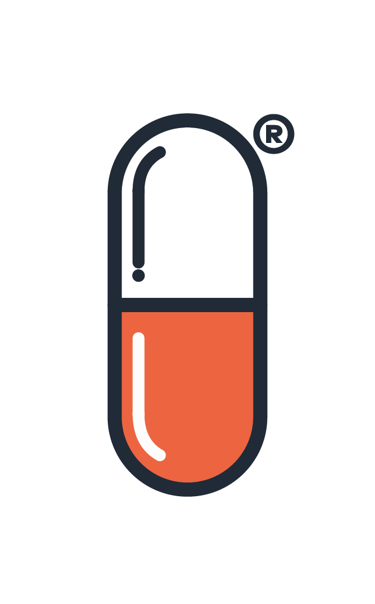

  
  <h1>BIM Pills</h1>
  
<strong>Píldoras inteligentes para optimizar tu flujo de trabajo en Autodesk Revit</strong>

  

    
    
    
  

---

## ¿Qué es BIM Pills?

BIM Pills es un plugin para Autodesk Revit que reúne en un solo lugar las herramientas más útiles del día a día en proyectos BIM. Está diseñado para equipos que trabajan con estándares de calidad, flujos de exportación y gestión eficiente de datos del modelo.

---

## Funcionalidades

### 🔍 Auditoría de Modelo
Evalúa la calidad y madurez BIM de tu modelo con una puntuación objetiva basada en estándares internacionales (ISO 19650-1/2, AEC UK BIM Protocol, BIM Forum LOD). Analiza:
- Peso del archivo y modelos de enlace
- Elementos no ubicados y advertencias activas
- Familias in-situ, importaciones CAD y grupos
- Elementos sin categoría y texturas embebidas
- Compatibilidad con Revit Server, BIM 360 y ACC
- **Elementos purgables** — detecta vistas, familias, materiales, tipos de familia sin uso y más; filtro dinámico por tipo de elemento

### 🎯 Seleccionar
Herramientas de selección y edición masiva de elementos en la vista activa:
- **Buscar y Seleccionar** — filtra elementos por categoría, parámetro y valor para seleccionarlos directamente en Revit
- **Etiquetar** — coloca etiquetas automáticamente en los elementos de una selección
- **Asignar Valores / Numerador** — asigna y ordena valores de parámetros en lote con lógica configurable

### 📤 Exportar
Exportación profesional de entregables directamente desde Revit:
- **Planos** — Exporta vistas y planos a PDF, DWG, DGN o imágenes con organización automática de carpetas por disciplina
- **Modelo** — Exporta el modelo a IFC, NWC/NWD y otros formatos de interoperabilidad
- **Familias** — Exporta familias del proyecto como archivos `.rfa` organizados por categoría
- **Parámetros** — Extrae parámetros del modelo (lat/lon, coordenadas, categoría, tipo, nivel, etc.) y los escribe directamente en elementos de Revit
- **Auditoría** — Genera reportes de calidad del modelo en Excel

### 📥 Importar
Importa plantillas, filtros y estándares desde archivos externos para homogeneizar proyectos del equipo.

### 🗝️ Keynotes
Gestión de notas clave del proyecto: edición, reorganización y sincronización del archivo de keynotes directamente desde Revit.

### 🔄 Trasladar
Transfiere estándares entre modelos: plantillas de vista, filtros, tipos de línea, patrones de relleno y más, desde un modelo origen hacia el modelo activo.

### 🗂️ Tablas
Gestión y exportación de tablas de planificación (schedules) de Revit a Excel:
- Vista previa de tablas con colores por tipo de parámetro (azul=instancia, naranja=tipo, amarillo=solo lectura)
- **Elementos de vínculos** — checkbox para incluir elementos de archivos vinculados (Revit Link); se muestran en gris en la vista previa y en el Excel exportado, con columna de origen y entrada en la leyenda; son ignorados automáticamente al importar
- Exportación e importación de valores desde/hacia Excel con protección de campos de solo lectura

### 📋 Documentar
Herramientas de documentación del modelo:
- **Acotado** — Acotado automático de elementos (vanos, puertas, ventanas) con esquemas configurables
- **Dibujar Tabla desde Excel** — Dibuja tablas en vistas de diseño de Revit directamente desde archivos `.xlsx`, con soporte de celdas fusionadas y colores

### 🔗 Conexión MCP
Integración experimental con servidores MCP para automatización avanzada del modelo desde herramientas externas.

---

## Compatibilidad

| Revit | .NET | Estado |
|-------|------|--------|
| 2024  | .NET Framework 4.8 | ✅ Soportado |
| 2025  | .NET 8 | ✅ Soportado |
| 2026  | .NET 8 | ✅ Soportado |
| 2027  | .NET 10 | ✅ Soportado |

**Sistema operativo:** Windows 10 / 11

---

## Instalación

1. Descarga el instalador desde [**Releases →**](../../releases/latest)
2. Cierra Revit si está abierto
3. Ejecuta **BIMPills-beta-7.4-Setup.exe** como administrador
4. Selecciona las versiones de Revit que tienes instaladas
5. Abre Revit — BIM Pills aparecerá en la cinta de opciones

### Actualizaciones automáticas
El plugin detecta nuevas versiones al arrancar Revit y te ofrece descargar e instalar la actualización sin salir de la aplicación.

### Desinstalación
Ve a **Panel de Control → Programas → BIM Pills** y haz clic en Desinstalar.

---

## Licencias

BIM Pills requiere una licencia activa para su uso. Contacta a soporte para obtener una licencia de evaluación o comercial.

📧 soporte@bim-ca.com  
🌐 [bim-ca.com](https://bim-ca.com)

---

  © 2026 BIM-CA (Prototype, S.A.) — Todos los derechos reservados

